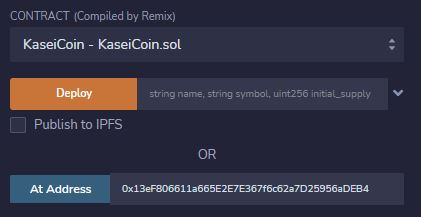
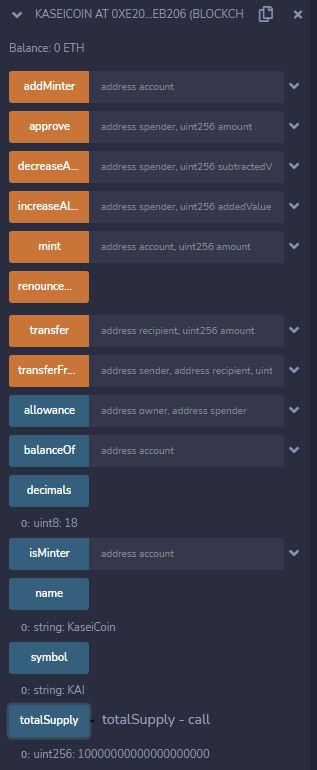

# Columbia Fintech Bootcamp: Module #21 Challenge

---

Feature Summary: Martian Token Crowdsale

Created a fungible token that is ERC-20 compliant that is minted by using a `Crowdsale` contract from the OpenZeppelin Solidity library.  This crowdsale contract manages the entire crowdsale process, allowing users to send ether to the contract and in return receive KAI, or KaseiCoin tokens. The contract will mint the tokens automatically and distribute them to buyers in one transaction.

- Includes the following tasks:

    - Creation of the KaseiCoin Token Contract
    - Creation of the KaseiCoin Crowdsale Contract
    - Creation of the KaseiCoin Deployer Contract
    - Deploying of the Crowdsale contract to a Local Blockchain
    - Optional: Extend the Crowdsale Contract by Using OpenZeppelin

---

## Technologies

This projects leverages the Remix IDE which is an open source application for developing, deploying, and administering smart contracts that run in Ethereum-based blockchains. 
  
- [Anaconda](https://docs.anaconda.com/anaconda/install/) - an open-source distribution of the Python
- [Remix IDE](https://remix.ethereum.org/) The Native IDE for Web3 Development.
- [Ganache](https://trufflesuite.com/ganache/) - personal Ethereum blockchain which you can use to run tests
- [MetaMask](https://metamask.io/) - A crypto wallet & gateway to blockchain apps

---

## Evaluation Evidence

### Compile the KaseiCoin Contract
 

### Compile the KaseiCoinCrowdsale Contract
 

### Compile the KaseiCoinCrowdsaleDeployer Contract
 

### Deploy the KaseiCoinCrowdsaleDeployer Contract (Remix deploy view)
 

### Deploy the KaseiCoinCrowdsaleDeployer Contract (Remix contract details view)
 

### Deploy the KaseiCoinCrowdsaleDeployer Contract (Ganache account view, gas paid)
 

### Deploy the KaseiCoinCrowdsaleDeployer Contract (Ganache transaction view)
 

### Deploy the KaseiCoinCrowdsaleDeployer Contract (Metamask deploy view)
 

### Setup KaseiCoin Crowdsale Contract Address (Remix view)
 

### Setup KaseiCoin Crowdsale Contract Details (Remix view)
 

### Setup KaseiCoin Contract Address (Remix view)
 

### Setup KaseiCoin Contract Details (Remix view)
 

### MetaMask Account3, Buy 1 KAI Token (Remix, setup buy)
 

### MetaMask Account3, Buy 1 KAI Token (Remix, KaseiCoinCrowdsale Contract Details before buy)
 

### MetaMask Account3, Buy 1 KAI Token (Remix, KaseiCoinCrowdsale Contract Details after buy)
 

### MetaMask Account3, Buy 1 KAI Token (Ganache view, accounts, -1 Ether for buyer, +1 Ether for wallet address)
 

### MetaMask Account3, Buy 1 KAI Token (Ganache view, transactions)
 

### MetaMask Account3, Buy 1 KAI Token (MetaMask view, -1 Ether for buyer)
 

### MetaMask Account3, Buy 1 KAI Token (MetaMask view, +1 Ether for wallet address)
 

### MetaMask Account3, Buy 1 KAI Token (MetaMask view, Import Tokens Config)
 

### MetaMask Account3, Buy 1 KAI Token (MetaMask view, Import Tokens Confirm)
 

### MetaMask Account3, Buy 1 KAI Token (Remix view, show KaseiToken Contract, totalSupply = 1 KAI)
 

### MetaMask Account4, Buy 2 KAI Token (Remix, setup buy)
 

### MetaMask Account4, Buy 2 KAI Token (Remix, KaseiCoinCrowdsale Contract Details before buy)
 

### MetaMask Account4, Buy 2 KAI Token (Remix, KaseiCoinCrowdsale Contract Details after buy)
 

### MetaMask Account4, Buy 2 KAI Token (Ganache view, accounts, -2 Ether for buyer, +2 Ether for wallet address)
 

### MetaMask Account4, Buy 2 KAI Token (Ganache view, transactions)
 

### MetaMask Account4, Buy 2 KAI Token (MetaMask view, -2 Ether for buyer)
 

### MetaMask Account4, Buy 2 KAI Token (MetaMask view, +2 Ether for wallet address)
 

### MetaMask Account4, Buy 2 KAI Token (MetaMask view, Import Tokens Config)
 

### MetaMask Account4, Buy 2 KAI Token (MetaMask view, Import Tokens Confirm)
 

### MetaMask Account4, Buy 2 KAI Token (Remix view, show KaseiToken Contract, totalSupply = 3 KAI)
 

### OPTIONAL: Deploy the KaseiCoinCrowdsaleDeployer Contract (Remix deploy view)
 

### OPTIONAL: Deploy the KaseiCoinCrowdsaleDeployer Contract (Remix contract details view)
 

### OPTIONAL: KaseiCoinCrowdsale Contract Details
 

### OPTIONAL: KaseiCoinContract Details
 

### OPTIONAL: Acct3 Buy 7 KAI Tokens (Token TotalSupply = 7 KAI)
 

### OPTIONAL: Acct3 Buy 7 KAI Tokens (Ganache view)
 

### OPTIONAL: Acct3 Buy 7 KAI Tokens (MetaMask View)
 

### OPTIONAL: Acct3 Buy 7 KAI Tokens (KaseiCoinCrowdsale Contract Status)
 

### OPTIONAL: Acct4 Buy 3 KAI Tokens (Token TotalSupply = 7 KAI)
 

### OPTIONAL: Acct4 Buy 3 KAI Tokens (Ganache view)
 

### OPTIONAL: Acct4 Buy 3 KAI Tokens (MetaMask View)
 

### OPTIONAL: Acct5 Buy 1 KAI Token After Crowdsale Time Elapsed - Error (Remix Error)
 

### OPTIONAL: Acct5 Buy 1 KAI Token After Crowdsale Time Elapsed - Error (MetaMask Error)
 

### OPTIONAL: Acct5 Buy 1 KAI Token After Crowdsale Time Elapsed - Error (Ganache, Confirm did not go through)
 

### OPTIONAL: Ganache view Before FINALIZE Crowsdsale (No Ether applied to Wallet)
 

### OPTIONAL: Ganache view After FINALIZE Crowsdsale (All 10 Ether applied to Wallet)
 

### OPTIONAL: Final State Of KaseiCoinCrowdsale Contract
 

### OPTIONAL: Final State Of KaseiCoin Contract
 

